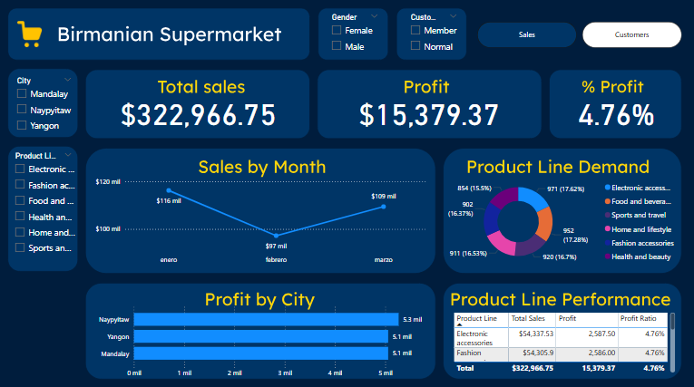

## Proyecto Analisis de Datos y Dashboard sobre ventas de un supermercado

Este proyecto consta sobre el analisis de datos mediante sentencias SQL y un dashboard realizado en Power BI sobre las ventas de un supermercado.

El dataset fue descargado de Kaggle, en el siguiente link se puede acceder a él. Todos los créditos para el autor: https://www.kaggle.com/datasets/akashbommidi/super-market-sales

## Estructura del proyecto

Consta de los siguientes directorios y archivos:
    - **/Dashboard:** Contiene el archivo de Power BI (.pbix).
    - **/MySQL:** Contiene las sentencias de SQL para análisis y manipulación de datos.
    - **/Dataset:** Contiene el dataset original utilizado en el análisis.

## Requisitos

Para poder usar todo el proyecto, se necesita tener instalado lo siguiente:
    - **Power BI Desktop**: Para abrir y visualizar el archivo `.pbix` del dashboard.
    - **Base de datos SQL**: Para ejecutar las sentencias SQL y analizar los datos.
    - **Microsoft SQL Server** o cualquier otro sistema que soporte SQL (En este caso, yo utilicé MySQL Workbench).

## Este proyecto responde preguntas como las siguientes:
    - ¿Cuanto es el ingreso y las ganancias totales?
    - ¿A qué hora es la "hora pico"?
    - ¿Quién ingresa más dinero? ¿Los clientes normales o los miembros?
    - ¿Cuáles son los productos más demandados?
    - ¿De cuanto es la rentabilidad?
    - ¿Qué tipo de producto se compra más?
    - ¿Cómo ha sido las ventas en los 3 meses?

## Instrucciones de Uso
    1. Clona este repositorio
    2. Importa el dataset en tu gestor SQL
    3. Ejecuta las sentencias SQL que están en la carpeta "MySQL"
    4. Abre el archivo .pbix dentro de la carpeta "Dashboard"
    5. Explora el dashboard y la tabla en SQL!

## Aquí se muestra una vista previa del dashboard

## Cualquier duda o comentario, puedes hacer pull request :D!